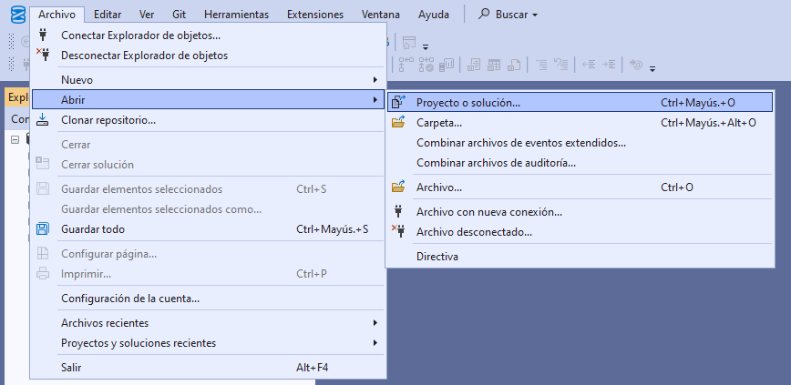
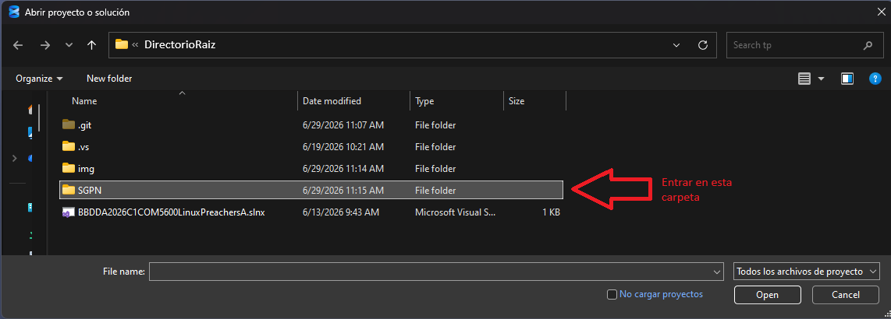
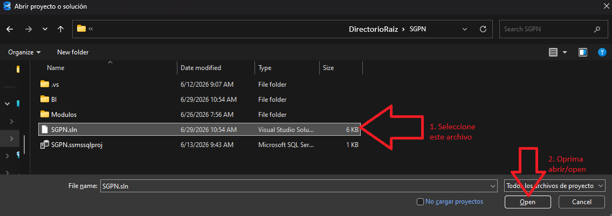
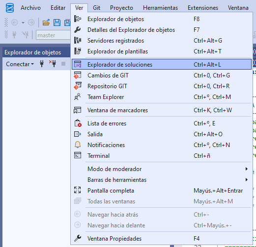

# BBDDA2026C1COM5600LinuxPreachersA

## Índice

- [Estado de las entregas](#estado-de-las-entregas)
- [Cómo utilizar este repositorio](#cómo-utilizar-este-repositorio)
- Tablas de Detalle
   - [Nombres de archivos](#nombres-de-archivos)
     - [Números de Módulos](#números-de-módulos)
     - [Usos de Archivos](#usos-de-archivos)
   - [Códigos de error por módulo](#códigos-de-error-por-módulo)

## Estado de las entregas

| Entrega                              | Estado        | Revision                |
| :----------------------------------- | :------------ | ----------------------- |
| **E3** - DER                         | ✅ Completada | ✅ Completada           |
| **E4** - Instalación y Configuración | ✅ Completada | ✅ Completada           |
| **E5** - Base de Datos               | ✅ Completada | ✅ Completada           |
| **E6** - Importación                 | ✅ Completada | 🚧 Revision tests pend. |
| **E7** - Reportes                    | ✅ Completada | 🚧 Revision tests pend. |
| **E8** - Seguridad y Respaldo        | ✅ Completada | ⏳ Pendiente            |
| **E9** - BI + Aplicación sencilla    | 🛠️ En trabajo | ⏳ Pendiente            |

### Desglose Entregas 8 y 9

| Entrega                      | Estado             | Revision Interna |
| :--------------------------- | :----------------- | ---------------- |
| **E8** - Cifrado             | ✅ Completada      | ✅ Completada    |
| **E8** - Roles               | ✅ Semi-Completada | ✅ Completada    |
| **E8** - Backups             | ✅ Completada      | ✅ Completada    |
| **E9** - BI                  | ✅ Completada      | ✅ Completada    |
| **E9** - Aplicación sencilla | 🛠️ En trabajo      | ⏳ Pendiente     |

---

## Como utilizar este repositorio

1. Instale SQL Server Managment Studio. _Para realizar la instalacion utilice el PDF
   que se encuentra en el directorio raiz, allí encontrará más intrucciones y detalles
   de instalación._
2. Abra el archivo `SGPN.sln` que encontrará en la carpeta `SGPN`
   
   
   
3. Abrir el explorador de soluciones 
4. Encontrara todos los archivos utilizados, separados por modulo y utilizacion.
   Vea mas información en [códigos de modulos](#códigos-de-error-por-módulo), [usos de archivos](#usos-de-archivos) y [numeración de archivos](#nombres-de-archivos)
---

### Nombres de archivos

| Digito | Utilizacion      |
| :----- | :--------------- |
| 1-2    | Numero de modulo |
| 3-4    | Uso del archivo  |
| 5      | Libre            |

#### Numeros de Modulos:

| Digitos | Modulo      |
| :------ | :---------- |
| 00      | Libre       |
| 01      | Parques     |
| 02      | Empleados   |
| 03      | Actividades |
| 04      | Reservas    |
| 05      | Pagos       |
| 06      | Concesiones |
| 07      | Roles       |
| 08      | Reportes    |
| 09      | Cifrado     |
| 10-99   | Libre       |

#### Usos de Archivos :

| Digitos | Modulo              |
| :------ | :------------------ |
| 00      | Libre               |
| 01      | Creación tablas     |
| 02      | ABM                 |
| 03      | Testing             |
| 04      | Generacion de datos |
| 05      | Importacion         |
| 06      | Ejemplo/Demo        |
| 07-99   | Libre               |

---

### Códigos de error por módulo

| Código | Módulo      |
| :----- | :---------- |
| 50.000 | Actividades |
| 50.100 | Empleados   |
| 50.200 | Parques     |
| 50.300 | Reservas    |
| 50.400 | Concesiones |
| 50.500 | Pagos       |
| 51.000 | Reportes    |
| 52.000 | Otros       |

> A cada módulo se le asignan 100 códigos de error a partir del código base indicado en la tabla.

---
